## Scope

 

## Output

### Application opens

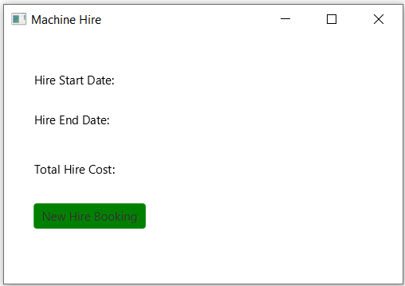

### When I hover over New Hire Booking button

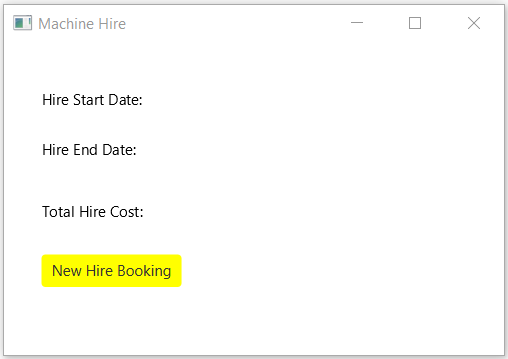

### When I click on this button, a dialog where we have to choose the dates and fill in the cost/day

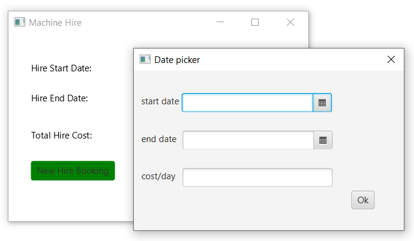

#### The date picker looks like

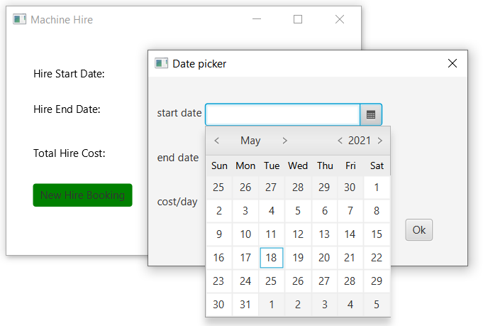

### Case 1: When I fill in the details correctly

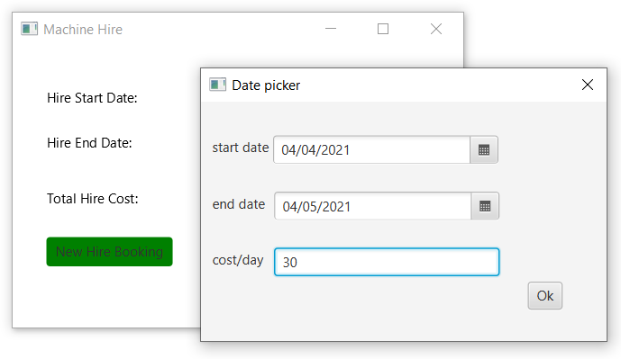

#### I click on ok and the main window shows the total amount to be paid to the worker for the number of days one worked = end date-start date

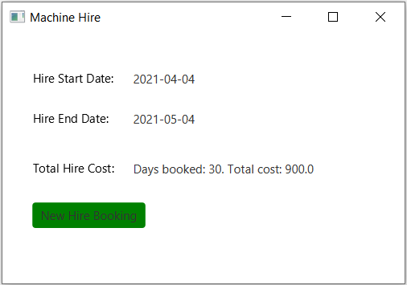

### Case 2: I fill in the cost but leave out dates field like the following

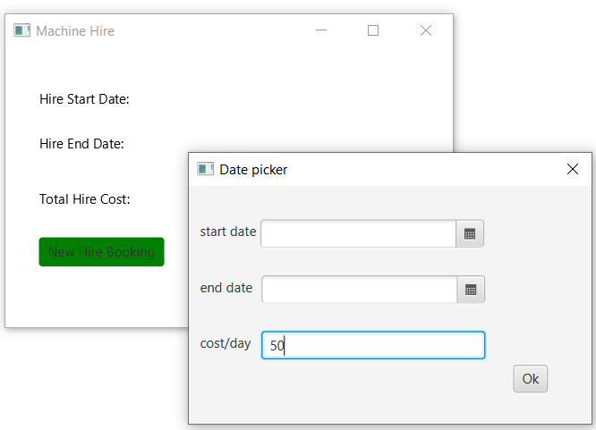

#### I click on ok and the main window shows error message

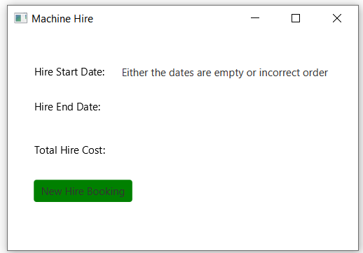

### Case 3: I choose the dates but leave out cost field like the following

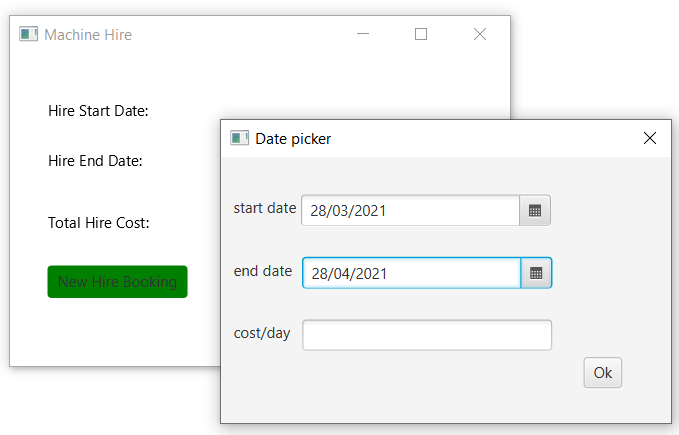

#### I click on ok and the main window shows error message

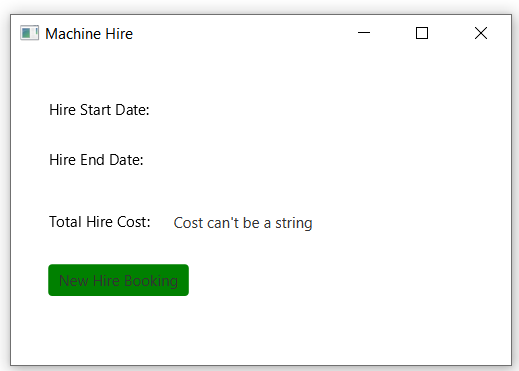

### Case 4: I choose the dates, fill in the cost field but the order of dates is incorrect, here the end date is before the start date like the following

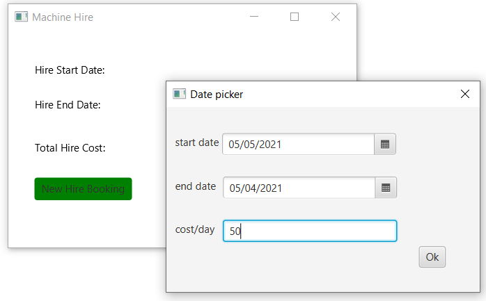

#### I click on ok and the main window shows error message

### Case 5: I choose the dates, fill in the cost field but the cost is negative like the following

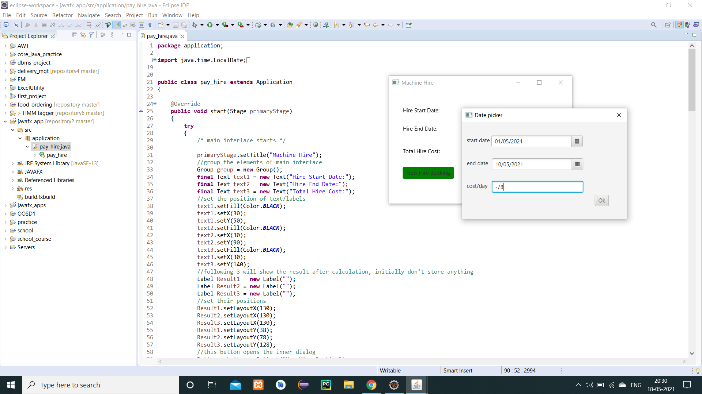

#### I click on ok and the main window shows error message

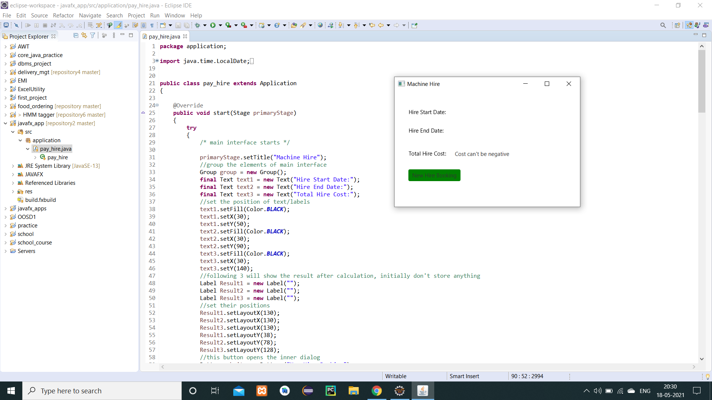

