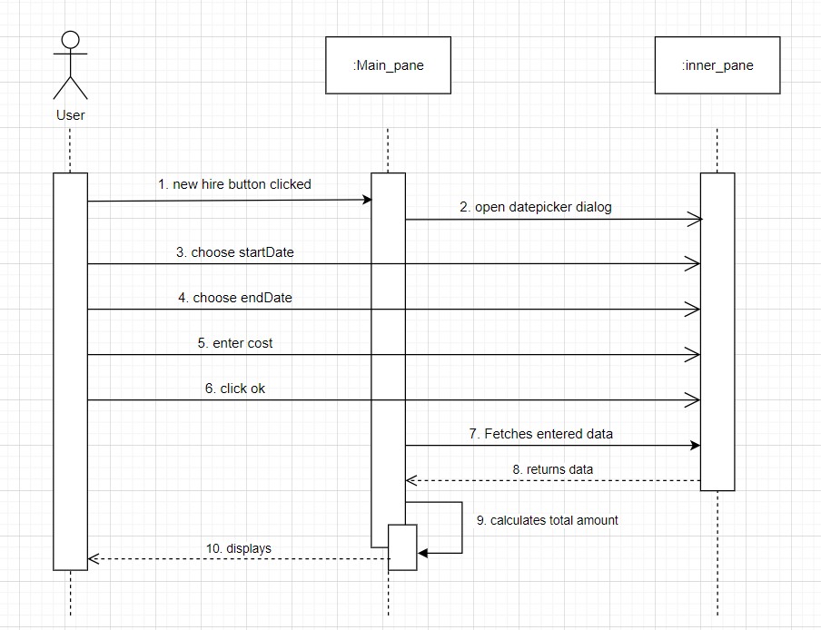
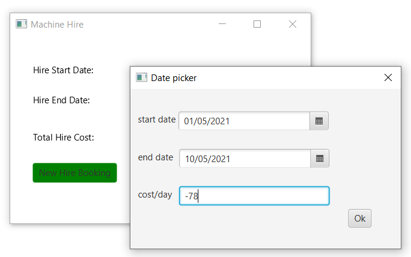
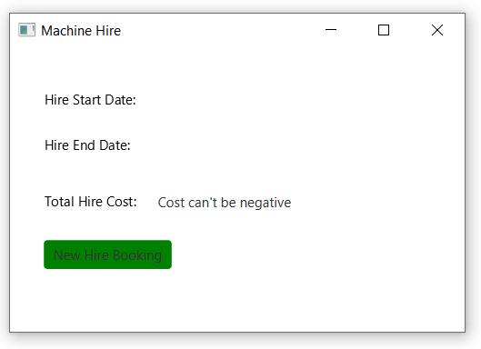
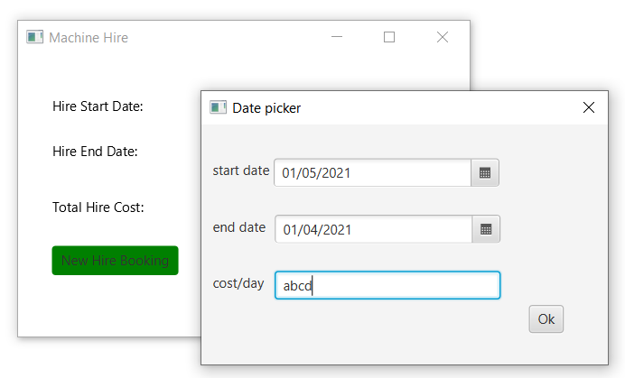

## Description

This project is made using JavaFX platform and CSS stylesheet. It can help to calculate the payment of the workers. It helped me to understand how inner dialog works simultaneously with the main pane.

 

## Sequence diagram:

 

## Output

### Application opens

### When I hover over New Hire Booking button

### When I click on this button, a dialog opens where we have to choose the dates and fill in the cost/day

#### The date picker looks like

### Case 1: When I fill in the details correctly

#### I click on ok and the main window shows the total amount to be paid to the worker for the number of days one worked = end date-start date

### Case 2: I fill in the cost but leave out dates field like the following

#### I click on ok and the main window shows error message

### Case 3: I choose the dates but leave out cost field like the following

#### I click on ok and the main window shows error message

### Case 4: I choose the dates, fill in the cost field but the order of dates is incorrect, here the end date is before the start date like the following

#### I click on ok and the main window shows error message

### Case 5: I choose the dates, fill in the cost field but the cost is negative like the following

#### I click on ok and the main window shows error message

### Case 6: When I leave out everything

#### I click on ok and the main window shows error - the very first thing which is not correct in the datepicker dialog will throw the error, so here it will show incorrect dates error because that is not chosen, later it will got to cost if the user picks the correct date

## Case 7: I enter everything incorrectly like the following

#### I click on ok and the main window shows error - the very first thing which is not correct in the datepicker dialog will throw the error, so here it will show incorrect dates error because that is not chosen, later it will got to cost if the user picks the correct date

